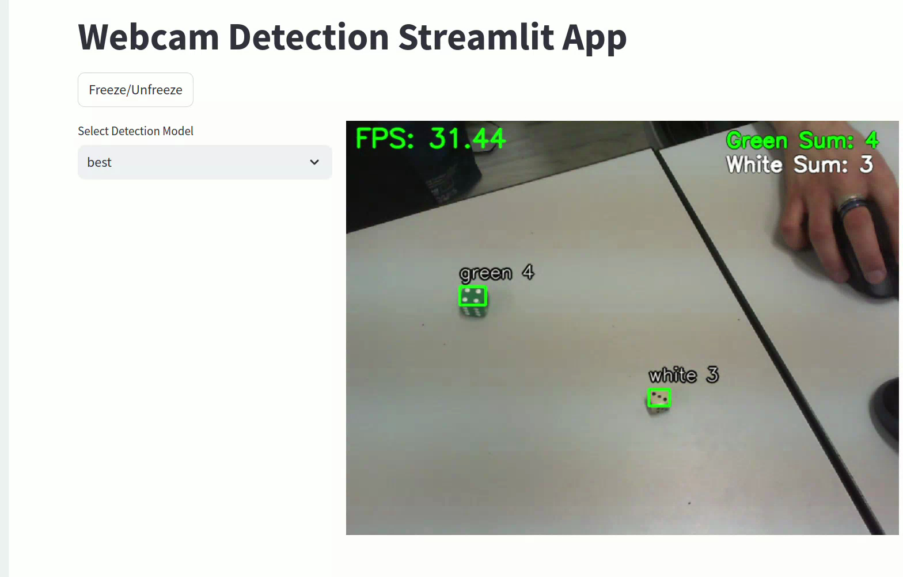
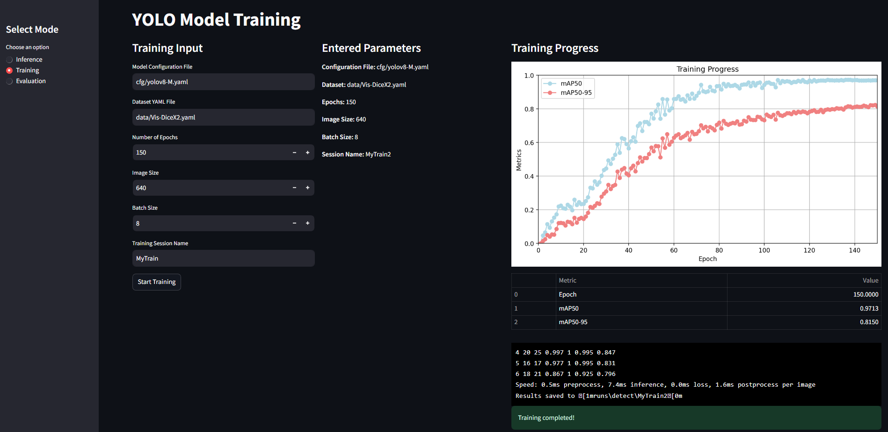

# Vis-DiceX<sup>2</sup>
> Vis-Dice<sup>2</sup> is a computer vision web-based tool build using streamlit to perform three functions: Inference, Training and Evaluation in several pre-trained models to detect sides of dice, additionally, it displays the color and the sum of visible dice of that color.

## Features
### Inference
> The user can display the YOLO model results in real-time within the web tool by selecting from a list of pre-trained models downloaded [here](https://drive.google.com/drive/folders/14hduF6_zP0yVD9t2IzsBDQ6UFfifeM7M?usp=sharing).


### Training
> Train your own model using [Ultralytics](https://github.com/ultralytics) and display the training graphs in real-time.


### Evaluation
> Evaluate the pre-trained models or your own and observe the results in a graph.
<center>
    
</center>


## Requirements
- **Python**: 3.10
- **CUDA Toolkit**: Compatible with Torch
- **Torch**: Required for deep learning operations

## Execution Guide
### Install pre-trained model weights
Install the pre-trained YOLO weights Here: [Google Drive Link](https://drive.google.com/drive/folders/14hduF6_zP0yVD9t2IzsBDQ6UFfifeM7M?usp=sharing). Finally, transfer the weights in the ``models/`` folder.
```
cd VisDiceX2
mkdir models
```

### Create the environment
Run the following commands to create and activate a new Conda environment:

```bash
conda create -n visdicex2 python=3.10 -y
conda activate visdicex2
```
### Install PyTorch 
Install PyTorch and CUDA libraries (CUDA version: 12.4) using Conda:
```bash
conda install pytorch torchvision torchaudio pytorch-cuda=12.4 -c pytorch -c nvidia
```
You can ensure torch is installed with cuda (inference/training on GPU) by executing the following code
```bash
python utils/check_torch_cuda.py
```

### Install dependencies
```
pip install -r requirements
```

### Run Code
```
streamlit run Vis-DiceX2.py
```
Good luck!


